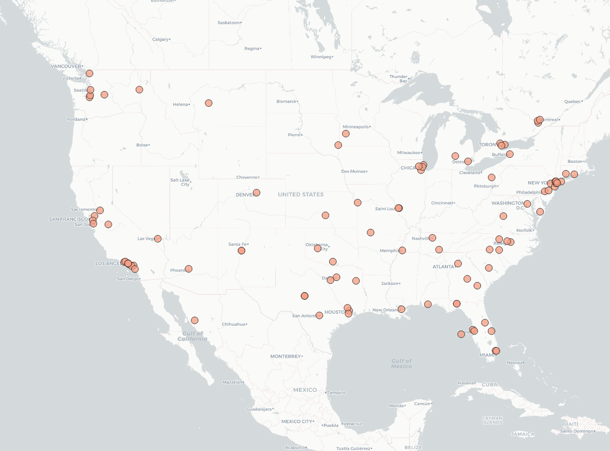

# Geo-Tagged Tweet Collection and Visualization

I have a map made in QGIS of the #coronawillendsoon from tweets posted on `Monday, April 20th 10:34am 2020` for 5 minutes! I used `stream.filter(track=['coronawillendsoon']` to filter my search. 

According to the map, it shows that Americans were still a bit hopeful that the Covid-19 outbreak will end soon! Additionally, I have this zoomed in on the United States because there were no tweets at the time that used #coronawillendsoon. 
